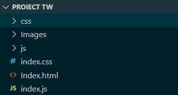

#  Pagina Web pentru un eveniment de lansare

#### Pagina este un single page layout compus din mai multe secțiuni, în care sunt adăugate informații despre lansarea unui automobil.

## Tehnologii folosite
* HTML
* CSS
* JavaScript 
* Bootstrap

## Structura proiectului (Structura fișierelor)
Structura fișierelor este următoarea: În fișierul sursă regăsim următoarele elemente:
* Din cadrul Bootstrap am adăugat fișierele reponsabile de CSS și Javascript (un folder cs, un folder js). Pentru a adăuga aceste foldere am instalat Bootstrap, iar din cadrul folderului principal am luat cele două foldere. Link-ul de unde poate fi descărcat: 
https://getbootstrap.com/docs/5.0/getting-started/download/ 
* Un folder Images în care se regăsesc imaginile folosite în cadrul proiectului
* Fișierul HTML
* Fișierul CSS
* Fișierul JavaScript


##### În cadrul fișierului HTML am importat următoarele fișiere, pentru a accesa Bootstrap, JQuery:
Fișierul CSS are scopul de a construi și stiliza interfața web.
Fișierul JavaScript conține toate funcționalitățile necesare pentru a face componentele interfeței web Bootstrap să funcționeze corect.
* ```<link href="https://cdn.jsdelivr.net/npm/bootstrap@5.3.0-alpha3/dist/css/bootstrap.min.css" rel="stylesheet" integrity="sha384-KK94CHFLLe+nY2dmCWGMq91rCGa5gtU4mk92HdvYe+M/SXH301p5ILy+dN9+nJOZ" crossorigin="anonymous">```
* ``` <script src="https://cdn.jsdelivr.net/npm/bootstrap@5.3.0-alpha3/dist/js/bootstrap.bundle.min.js" integrity="sha384-ENjdO4Dr2bkBIFxQpeoTz1HIcje39Wm4jDKdf19U8gI4ddQ3GYNS7NTKfAdVQSZe" crossorigin="anonymous"></script>```
##### JQuery este o bibliotecă JavaScript open-source care simplifică procesul de scriere a codului JavaScript. Acesta este folosit pentru a manipula și controla elemente HTML, pentru a crea efecte vizuale, animații, etc.
* ```<script src="https://code.jquery.com/jquery-3.6.0.min.js"></script> ```

### Cerințe de configurare/instalare
* Descărcați proiectul în calculator
* Dezarhivați proiectul
* Deschideți folderul și deschideți Index.html în browser 
##### Dacă vreți să rulați proiectul într-un mediu de dezvoltare(Visual Studio)
* Asigurați-vă că aveți instalat un mediu de dezvoltare
* Deschideți folderul dezarhivat
* Rulați programul

### Probleme care pot apărea
* Fundalul parallax nu funcționează în browser


